# 家庭健康中心 · 使用说明（图文版）

> 一个面向**家庭**的健康数据管理应用：家庭成员共同记录血压/心率/血糖/体温/体重，
> 拍照自动识别血压计读数，异常自动预警，数据可导出留档。
>
> 配套文档：`docs/api.md`（接口）、`docs/database.md`（数据库）、`docs/aliyun-deployment.md`（部署）、`docs/user-manual.md`（纯文字版手册）

---

## 目录

1. [这是什么](#一这是什么)
2. [系统架构](#二系统架构)
3. [角色与权限](#三角色与权限)
4. [界面总览](#四界面总览)
5. [功能使用详解](#五功能使用详解)
6. [核心流程图](#六核心流程图)
7. [后端与数据库](#七后端与数据库)
8. [部署与运维](#八部署与运维)
9. [质量与验证](#九质量与验证)
10. [故障排查](#十故障排查)

---

## 一、这是什么

### 它解决什么问题

| 痛点 | 本应用的做法 |
|---|---|
| 家里老人的血压计读数要手抄到本子上 | **拍照识别**，自动读出收缩压/舒张压/脉搏 |
| 一家人各自的数据分散、互相不知道 | **家庭**维度共享，成员各自记录、彼此可见 |
| 血压偏高时没人提醒 | **预警规则**：超过阈值自动产生预警记录 |
| 复诊时医生说"把最近的数据给我" | **一键导出** CSV / JSON / Excel |

### 功能一览

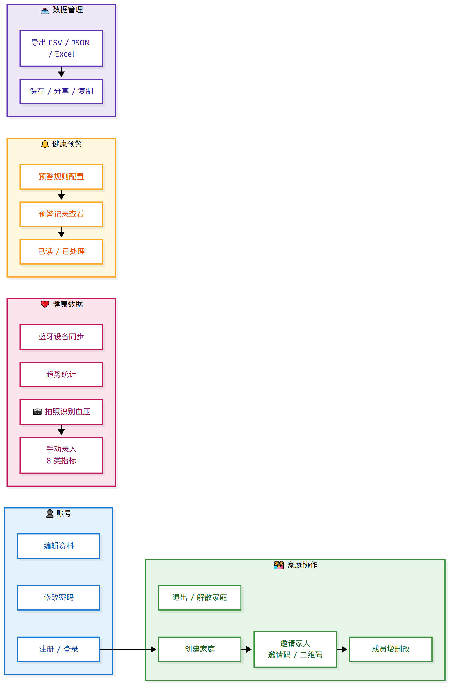

<sub>▲ 功能一览　（源文件 `docs/diagrams/01-features.mmd`）</sub>

---

## 二、系统架构

### 整体架构

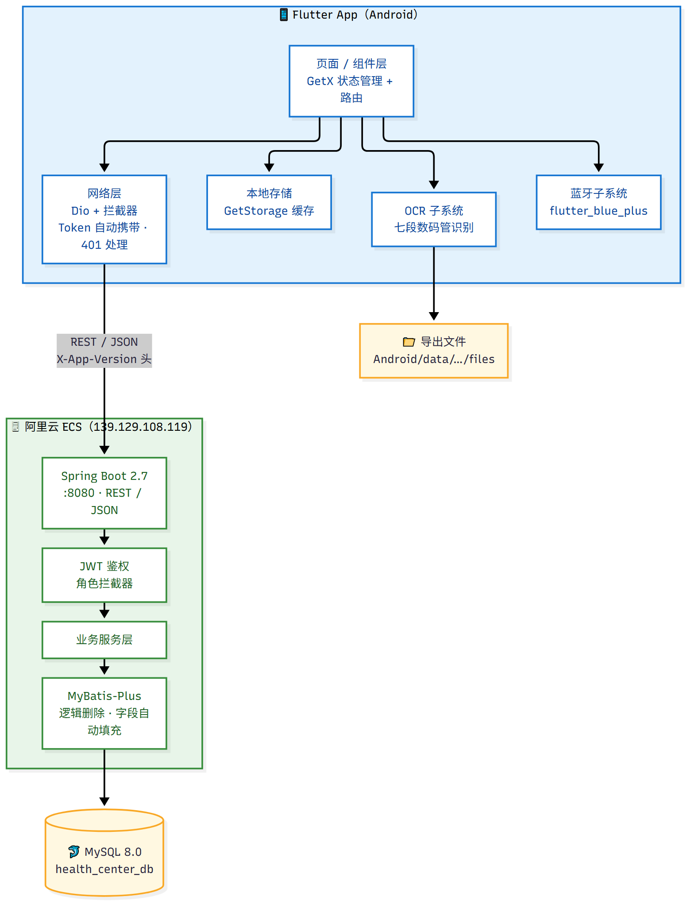

<sub>▲ 系统整体架构　（源文件 `docs/diagrams/02-architecture.mmd`）</sub>

### 技术栈

| 层 | 技术 | 版本 | 作用 |
|---|---|---|---|
| 客户端 | Flutter / Dart | 3.24.5 / 3.5.4 | 跨平台 UI |
| 状态管理 | GetX | — | 响应式状态 + 路由 + 依赖注入 |
| 屏幕适配 | flutter_screenutil | — | 设计稿等比缩放 |
| 图表 | fl_chart | — | 趋势统计 |
| 网络 | Dio | — | 拦截器统一处理 Token / 错误 |
| 本地存储 | GetStorage | — | 登录态、缓存 |
| 蓝牙 | flutter_blue_plus | — | BLE 心率设备 |
| 服务端 | Spring Boot | 2.7.18 | REST API |
| 持久层 | MyBatis-Plus | 3.5.5 | ORM + 逻辑删除 + 自动填充 |
| 鉴权 | JJWT | 0.12.3 | 无状态 Token |
| 数据库 | MySQL | 8.0.46 | 业务数据 |
| 开发态数据库 | H2（内存） | — | 本地免安装调试 |

---

## 三、角色与权限

**重点：本项目有两套"角色"概念，容易混淆，务必区分。**

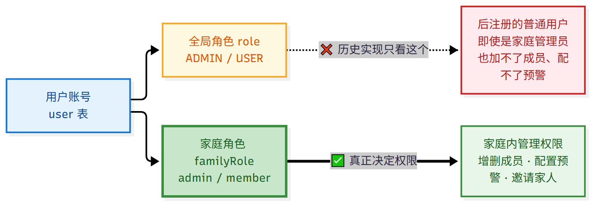

<sub>▲ 角色与权限关系　（源文件 `docs/diagrams/03-roles.mmd`）</sub>

| 能力 | 家庭管理员<br/>（familyRole=admin） | 普通成员<br/>（familyRole=member） |
|---|:---:|:---:|
| 查看家庭 / 成员列表 | ✅ | ✅ |
| 新增 / 编辑 / 删除家庭成员 | ✅ | ❌ |
| 配置预警规则 | ✅ | ❌ |
| 邀请家人（查看邀请码） | ✅ | ❌ |
| 退出家庭 | 需先转让或解散 | ✅ |
| 录入 / 查看健康数据 | ✅ | ✅ |

> ⚠️ **曾经的坑（已修）**：权限判定一度只看全局 `role`，导致"后注册的普通用户即使自己建了家庭、是该家庭管理员，也加不了成员、配不了预警"。现已改为"全局 ADMIN **或** 家庭管理员"任一满足即通过。

---

## 四、界面总览

| 首页 | 成员 | 健康 |
|---|---|---|
| 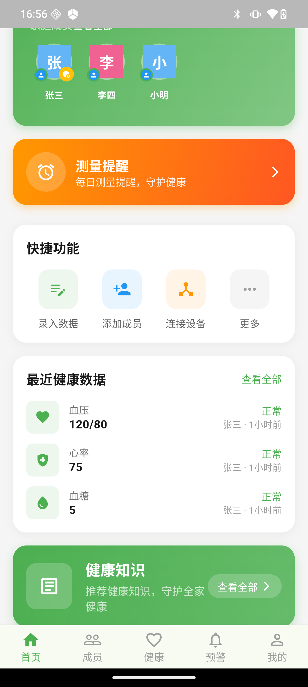 | 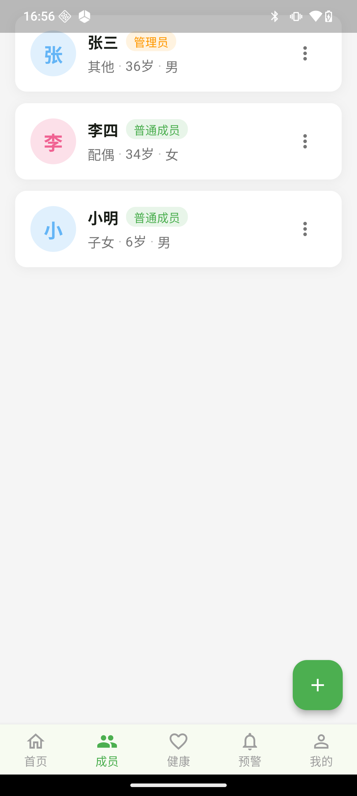 | 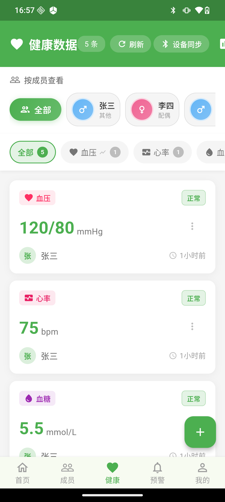 |
| 健康分、家庭概览、今日待办 | 家庭成员卡片、角色/关系/年龄 | 健康数据列表、按成员/类型筛选 |

| 预警 | 我的 |
|---|---|
| 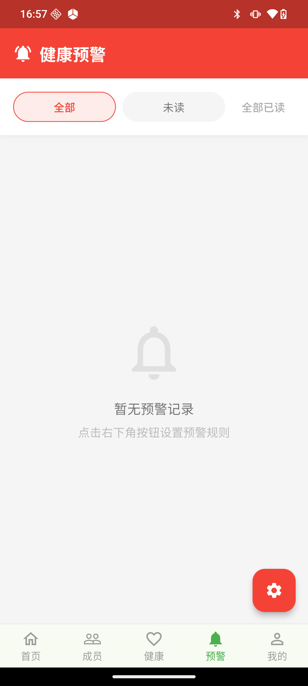 | 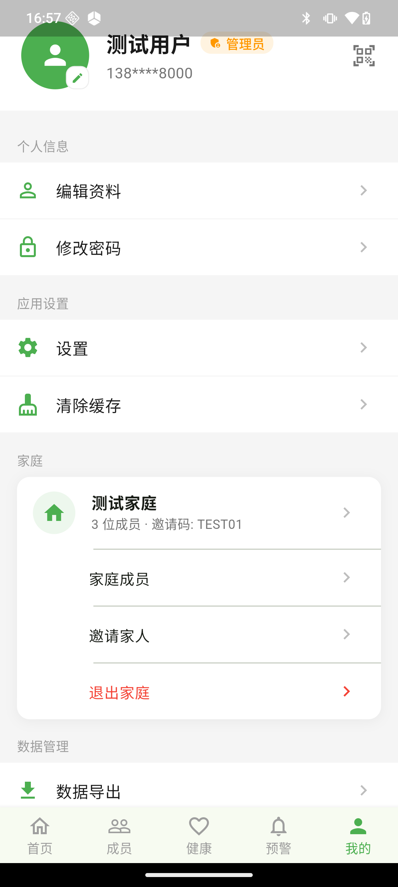 |
| 预警记录、全部已读、规则入口 | 个人信息、家庭卡片、数据管理、设置 |

---

## 五、功能使用详解

### 5.1 注册与登录

| 登录 | 注册 |
|---|---|
| 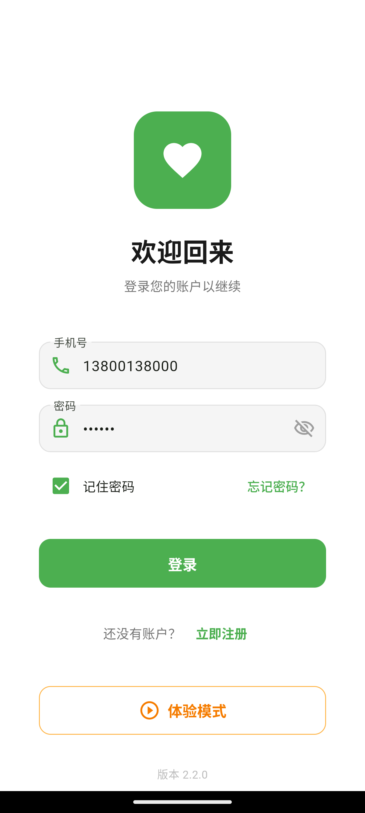 | 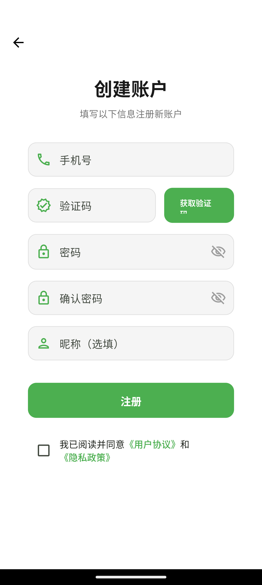 |

**登录步骤**

1. 输入 11 位手机号
2. 输入密码（可勾选「记住密码」，下次自动回填）
3. 点「登录」

> 登录失败时会明确提示原因（如「手机号或密码错误」）。**注意**：早期版本输错密码界面毫无反应、还会清空手机号，原因是把业务 401 当成了"Token 过期"并跳转登录页 —— 现已修复。

**注册步骤**

1. 登录页点「立即注册」
2. 依次填写：手机号 → 验证码 → 密码 → 确认密码（昵称可选）
3. 点「获取验证码」（开发模式下任意 6 位数字均可）
4. 勾选协议后点「注册」→ 自动登录进入首页

> ⚠️ **上线前必须处理**：当前后端**未校验验证码**（`UserServiceImpl` 中直接跳过），且没有发码接口。也就是说任何人可用任意 6 位数字注册任意手机号。需接入短信服务或明确改为免验证注册。

### 5.2 首页


- **健康分**：综合近期数据的健康评分
- **家庭健康状况**：家庭成员数、今日录入条数、异常预警条数
- **测试家庭卡片**：家庭名、成员数、邀请码
- 点「查看全部」或成员头像可进入成员/健康详情

### 5.3 创建 / 加入家庭

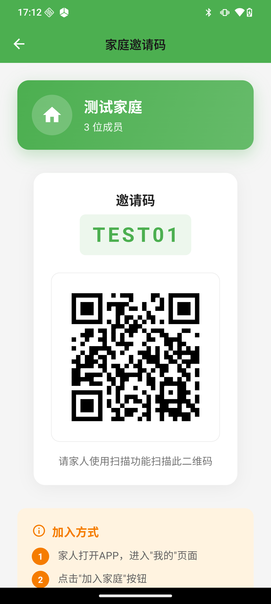

| 操作 | 路径 | 说明 |
|---|---|---|
| 创建家庭 | 首页「创建或加入家庭」→「创建家庭」→ 输入家庭名 | 创建者自动成为家庭管理员 |
| 加入家庭 | 首页「创建或加入家庭」→「扫码加入」 | 扫家人分享的二维码 |
| 邀请家人 | 我的 →「邀请家人」 | 显示 6 位邀请码 + 二维码 |

邀请页会显示**家庭名、成员数、邀请码**（如 `TEST01`）与二维码，家人扫码或输入邀请码即可加入。

### 5.4 家庭成员管理

| 成员列表 | 编辑成员 |
|---|---|
|  | 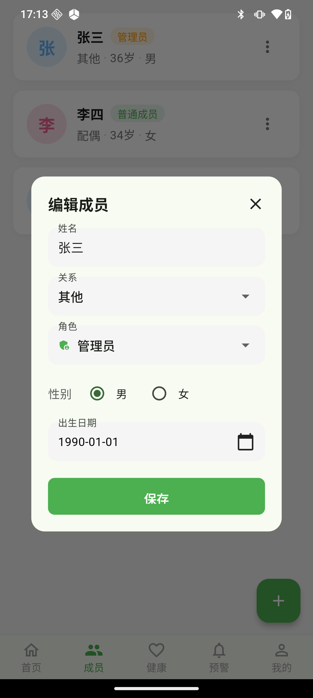 |

**添加成员**：成员页右下角 ➕ → 填写姓名 / 性别 / 关系 / 角色 / 出生日期 → 保存

**编辑 / 删除**：点成员卡片右侧按钮 → 选择「编辑」或「删除」

可选关系：父亲、母亲、配偶、子女、丈夫、妻子、儿子、女儿、爷爷、奶奶、外公、外婆、其他

> ⚠️ **曾经的坑（已修）**：成员增删改一度是**假实现**（只改内存、提示"成功"、服务端从未收到请求），重启 App 后改动全部消失。现已改为真实调用接口，并以服务端返回为准刷新列表。

### 5.5 录入健康数据

| 健康数据列表 | 添加记录 |
|---|---|
|  | 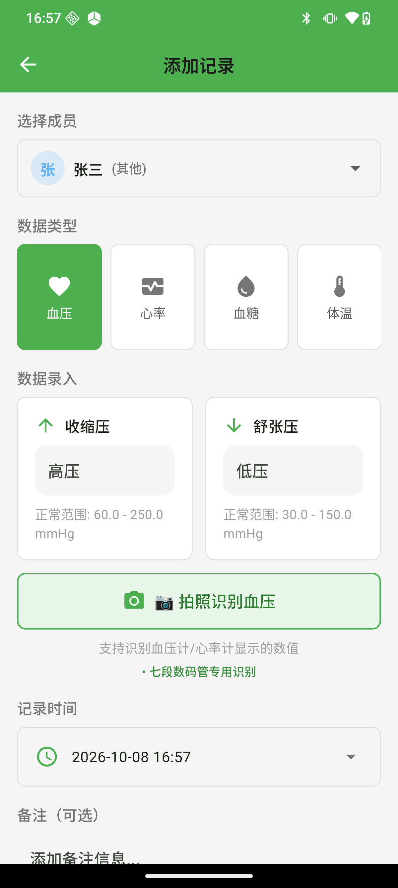 |

**手动录入**

1. 健康页点右下角 ➕
2. 选择成员与数据类型（血压 / 心率 / 血糖 / 体温 / 体重 / 身高 / 步数 / 睡眠）
3. 填写数值（界面显示正常范围提示）
4. 点「保存记录」

### 5.6 拍照识别血压（OCR）

| 识别方式选择 |
|---|
| 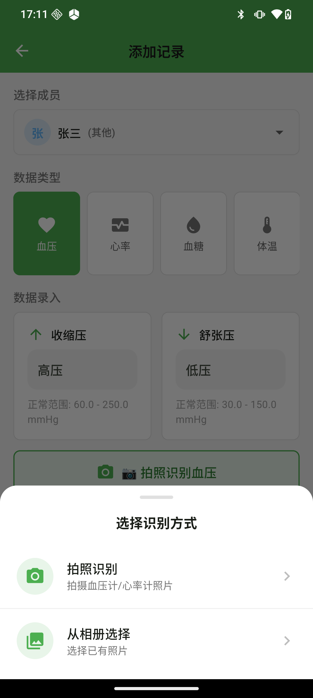 |

**操作**：添加记录页 →「📷 拍照识别血压」→「拍照识别」或「从相册选择」→ 自动识别 → 弹窗确认 →「确认填充」

识别成功后弹窗会显示识别结果（如 `血压: 120.0/80.0 mmHg，心率: 75.0 bpm`），并可一键填入表单；识别结果可手动修改。

> 📖 识别原理与精度数据见 [9.1 OCR 精度](#91-ocr-精度实测)

### 5.7 健康预警


- **预警记录列表**：按「全部 / 未读 / 待处理」筛选，可「全部已读」
- **预警规则**：点右上角规则图标进入（可添加数据类型的阈值规则）

### 5.8 数据导出

| 导出配置 | 导出结果 |
|---|---|
| 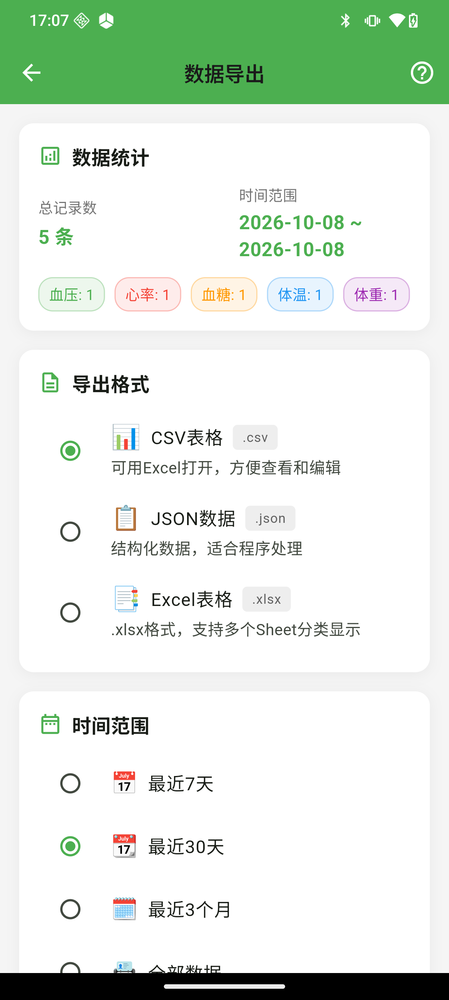 | 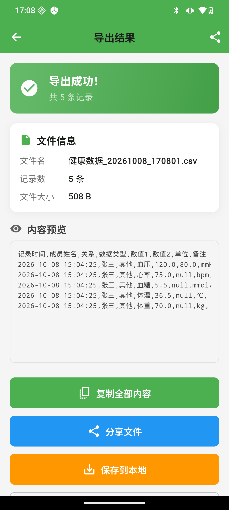 |

**步骤**

1. 我的 →「数据导出」
2. 查看统计（总记录数、时间范围、各类型条数）
3. 选择导出格式（CSV / JSON / Excel）与时间范围（最近 7 天 / 30 天 / 3 个月 / 全部）
4. 勾选要导出的数据类型
5. 点「导出数据」→ 进入结果页
6. 结果页可「保存到本地」「分享文件」「复制全部内容」

**保存位置**：`/storage/emulated/0/Android/data/com.healthcenter.health_center_app/files/HealthExport/`

### 5.9 个人中心与设置

| 我的 | 设置 | 修改密码 |
|---|---|---|
|  | 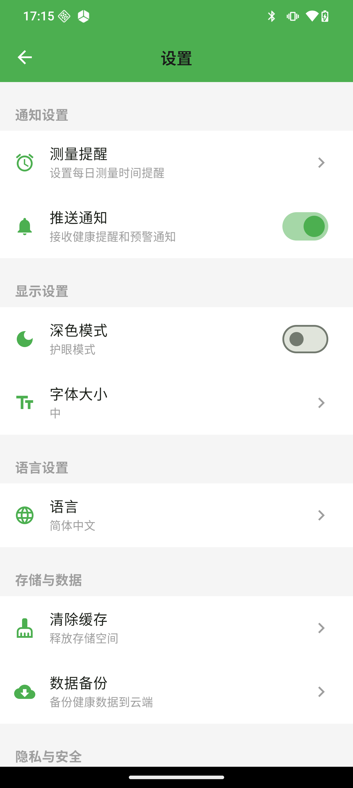 | 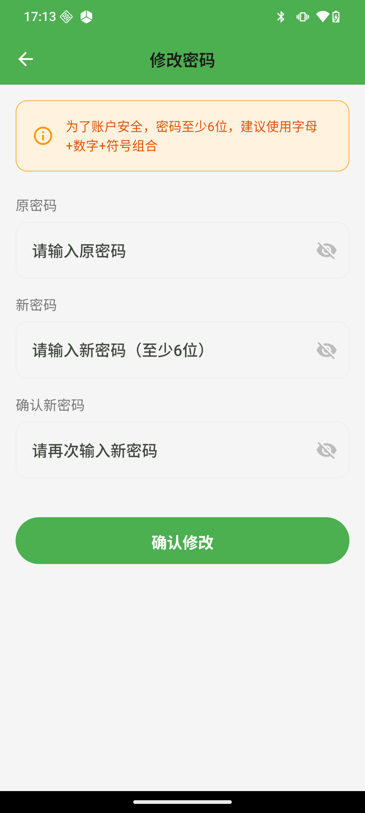 |

- **编辑资料**：修改昵称、性别、生日、头像
- **修改密码**：原密码 + 新密码 + 确认新密码（≥6 位）
- **设置**：通知开关、测量提醒时间、隐私政策、清除缓存、版本信息
- **清除缓存**：清理本地健康数据 / 日记 / 打卡 / 内容 / 预警记录缓存（**不影响**登录态与家庭成员）

---

## 六、核心流程图

### 6.1 登录鉴权流程

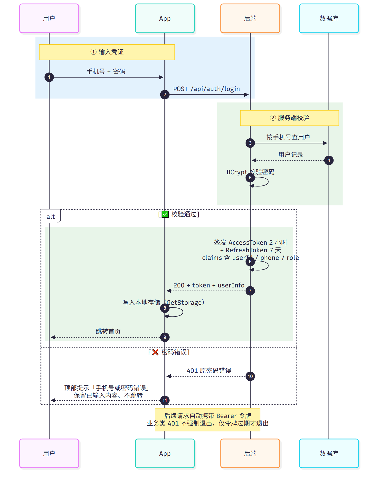

<sub>▲ 登录鉴权时序　（源文件 `docs/diagrams/04-login-seq.mmd`）</sub>

### 6.2 OCR 拍照识别流程

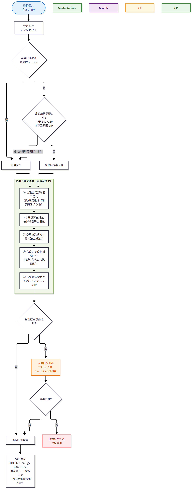

<sub>▲ OCR 拍照识别流程　（源文件 `docs/diagrams/05-ocr-flow.mmd`）</sub>

> 关键设计：**多假设择优**。二值化极性、开运算开关、膨胀半径、是否合并散段，全部作为独立假设分别尝试，最后按统一评分选最优结果，避免被单一假设绑死。

### 6.3 预警产生流程

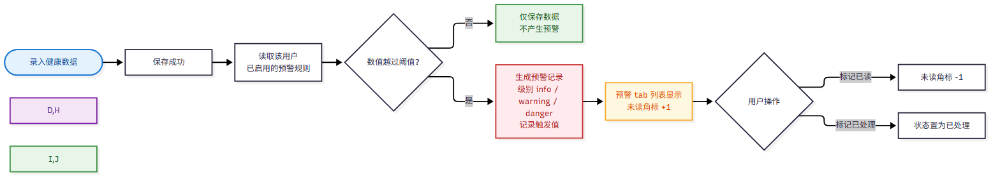

<sub>▲ 预警产生流程　（源文件 `docs/diagrams/06-alert-flow.mmd`）</sub>

### 6.4 家庭协作流程

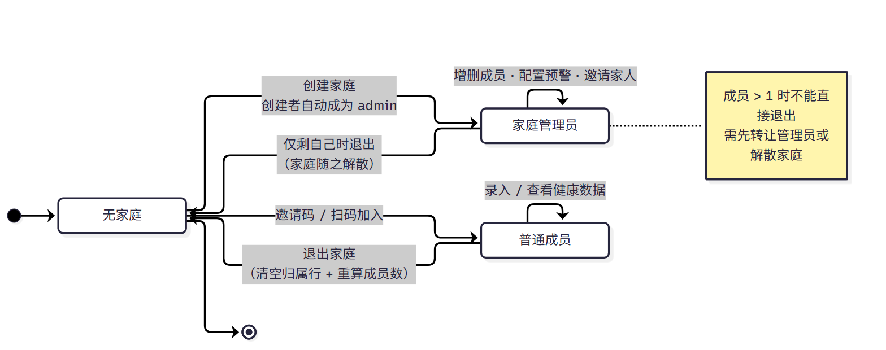

<sub>▲ 家庭协作状态流转　（源文件 `docs/diagrams/07-family-state.mmd`）</sub>

### 6.5 数据导出流程

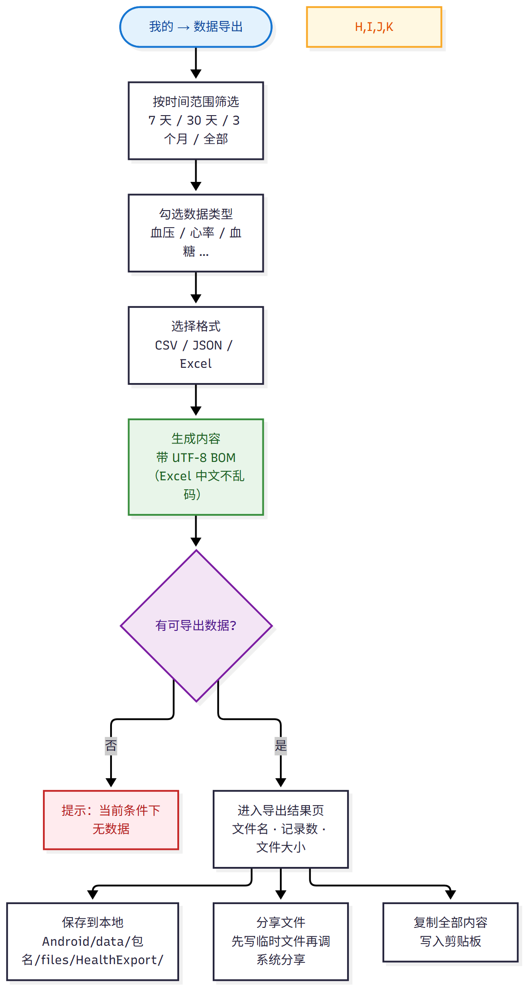

<sub>▲ 数据导出流程　（源文件 `docs/diagrams/08-export-flow.mmd`）</sub>

---

## 七、后端与数据库

### 7.1 分层结构

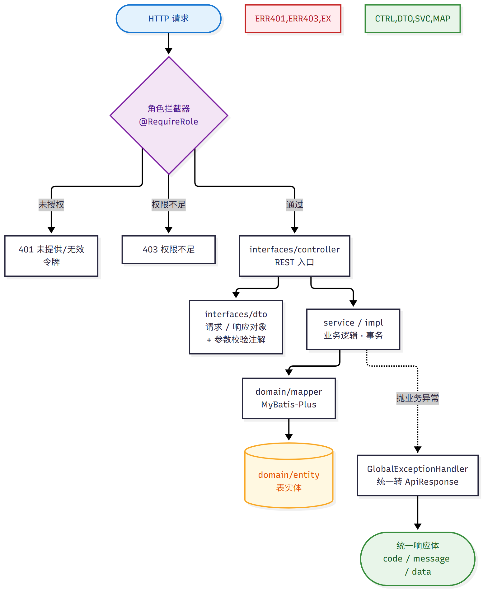

<sub>▲ 后端分层与请求链路　（源文件 `docs/diagrams/09-backend-layers.mmd`）</sub>

### 7.2 数据库关系

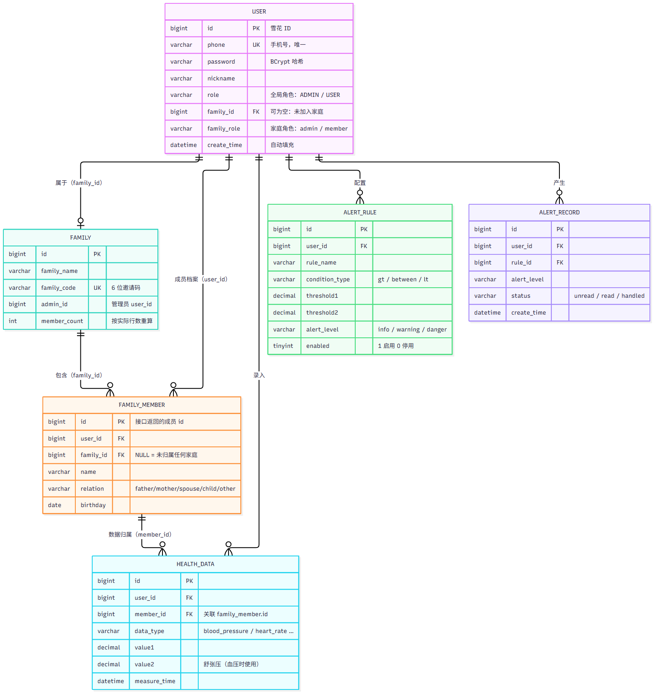

<sub>▲ 数据库关系（ER）　（源文件 `docs/diagrams/10-er.mmd`）</sub>

### 7.3 主要接口

| 分类 | 接口 | 说明 |
|---|---|---|
| 认证 | `POST /api/auth/register` `login` `refresh` `logout` `change-password` | 注册/登录/刷新/登出/改密 |
| 用户 | `GET /user/info`、资料更新 | 个人信息 |
| 家庭 | `POST /api/family/create` `join` `leave` | 创建/加入/退出 |
| 家庭 | `GET /api/family/my` `members` `qrcode` `info/{code}` | 家庭信息/成员/二维码/邀请码解析 |
| 成员 | `GET/POST /api/members`、`PUT/DELETE /api/members/{id}` | 成员增删改查 |
| 健康 | `GET/POST /api/health-data` | 健康数据 |
| 预警 | `GET/POST /api/alert-rules`、`PUT/DELETE /api/alert-rules/{id}`、`/{id}/toggle` | 规则管理 |
| 预警 | `GET /api/alert-records` | 预警记录 |

---

## 八、部署与运维

### 8.1 部署拓扑

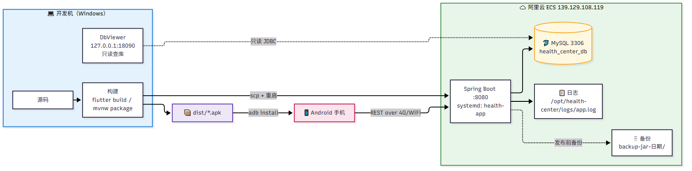

<sub>▲ 部署拓扑　（源文件 `docs/diagrams/11-deploy.mmd`）</sub>

### 8.2 发布流程

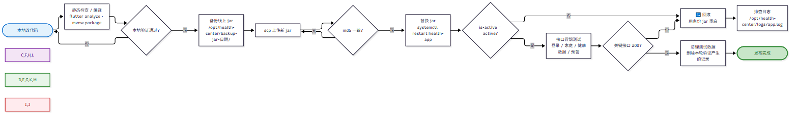

<sub>▲ 发布流程　（源文件 `docs/diagrams/12-release.mmd`）</sub>

**常用运维命令**

```bash
# 服务状态 / 重启
systemctl status health-app
systemctl restart health-app

# 看日志
tail -f /opt/health-center/logs/app.log

# 回滚
cp /opt/health-center/backup-jar-<时间>/health-center-backend-1.0.0.jar \
   /opt/health-center/target/health-center-backend-1.0.0.jar
systemctl restart health-app
```

### 8.3 本地调试（免装 MySQL）

```bash
# 用 H2 内存库启动后端（每次重启数据重置，适合测试）
java -jar spring-boot-backend/target/health-center-backend-1.0.0.jar --spring.profiles.active=dev

# 手机通过 USB 隧道访问本机后端
adb reverse tcp:8080 tcp:8080
# App 用 --dart-define=BASE_URL=http://127.0.0.1:8080 构建
```

---

## 九、质量与验证

### 9.1 OCR 精度实测

**方法**：用程序生成**真值已知**的七段数码管图像（4 种液晶风格 × 12 组数值 × 4 档退化 = 192 张），
跑真实检测代码逐张比对。基准工具在 `flutter-app/tool/`，可随时重跑回归。

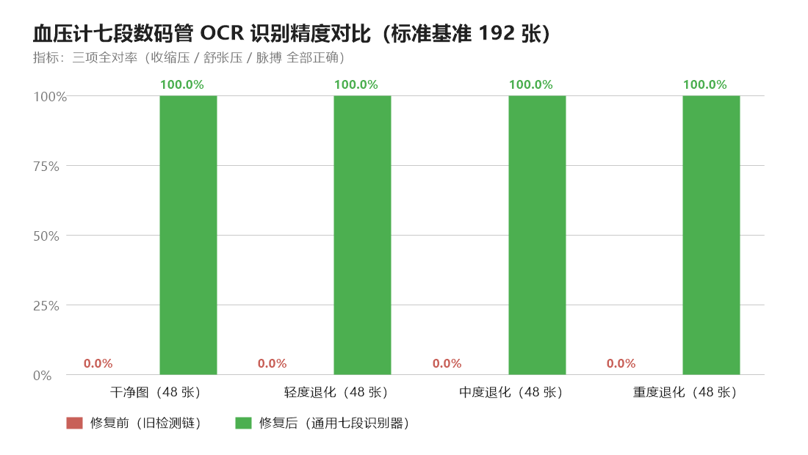

| 指标 | 修复前（旧检测链） | 修复后（通用七段识别器） |
|---|---|---|
| 收缩压正确 | 0.5% | **100.0%** |
| 舒张压正确 | 5.2% | **100.0%** |
| 脉搏正确 | 3.1% | **100.0%** |
| **三项全对** | **0.0%** | **100.0%** |
| 干净图（48 张） | 0.0% | **100%** |
| 退化图（144 张） | 0.0% | **100%** |

> 退化档位含：噪声、高斯模糊、亮度/对比度偏移、降采样、JPEG 压缩。

**复现方式**

```bash
cd flutter-app
dart run tool/ocr_bench.dart gen all      # 生成数据集
dart run tool/ocr_bench_compare.dart tool/ocr_bench_data   # 新旧链路对比
dart run tool/ocr_debug_one.dart tool/ocr_bench_data/s0_v0_clean.png --full  # 单图诊断
```

### 9.2 真机验证

在真机上用同一批图片复验，日志确认走的是新识别器：

```
[SevenSegment] 原始图像尺寸: 900x620
[SevenSegment] 尝试通用七段识别器...
[SevenSegment] ✓ 通用七段识别成功: 101/71, 73 bpm (置信度 0.92)     ← 耗时约 1.4 秒
[OcrButton] 识别结果: isValid=true, systolic=101.0, diastolic=71.0, heartRate=73.0
```

该图真值 `101/71/73`，识别结果完全一致。

### 9.3 已知限制

| 限制 | 说明 |
|---|---|
| 验证码未校验 | 后端跳过短信校验，上线前必须处理 |
| 健康内容为空 | `health_content` 表无数据，App 显示「内容服务暂未接入」 |
| 日记 / 提醒 / 设备为本地功能 | 后端无对应接口，换机不迁移 |
| 蓝牙同步 | 依赖设备广播，实测部分心率设备连上后收不到数据 |
| 复杂机身背景的识别 | 含外壳/反光/斜拍的严苛场景仍在迭代 |

---

## 十、故障排查

### 10.1 排查决策图

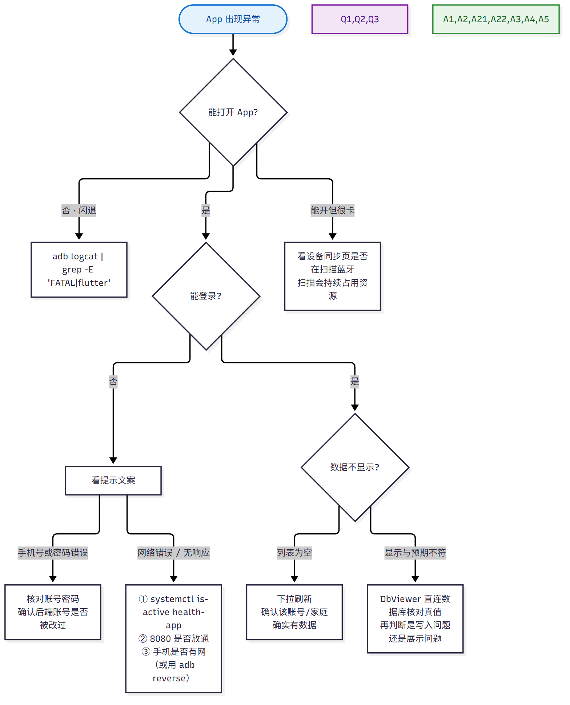

<sub>▲ 故障排查决策　（源文件 `docs/diagrams/13-troubleshoot.mmd`）</sub>

### 10.2 常见问题

| 现象 | 可能原因 | 处理 |
|---|---|---|
| 登录后停在登录页 | Token 未存 / 接口 401 | 查后端日志 `用户登录成功`，再看是否返回了 token |
| 成员列表为空但家庭有人 | 成员行 `family_id` 为空（历史孤儿行） | 属于已知历史数据问题，已修复新增路径 |
| 新增成员后看不到 | 早期 bug：未写 `family_id` | 已修复 |
| 拍照识别失败 | 图片过小 / 屏幕检测裁剪过度 | 已加裁剪保护；重拍更清晰的整屏照片 |
| 导出文件找不到 | Android 10+ 应用专用目录 | 路径见 App 内提示，或用「分享文件」转发 |
| 改密码输错原密码被踢下线 | 早期 bug：业务 401 被当作 Token 过期 | 已修复为排除 `/api/auth/**` |
| 清除缓存提示"已清除 0 条" | 本地缓存本就为空 | 正常现象 |

---

## 附录：目录结构

```
ReadHealthInfo/
├── flutter-app/                    # 客户端
│   ├── lib/
│   │   ├── app/modules/            # 功能模块（GetX）
│   │   │   ├── login/ register/    # 登录注册
│   │   │   ├── home/               # 首页 + 5 个 tab 页
│   │   │   ├── members/ family/    # 成员与家庭
│   │   │   ├── health/             # 健康数据
│   │   │   ├── alerts/             # 预警
│   │   │   ├── export/             # 导出
│   │   │   └── profile/            # 个人中心
│   │   ├── core/
│   │   │   ├── ocr/                # OCR 子系统（识别器 + 基准可跑）
│   │   │   ├── bluetooth/          # 蓝牙
│   │   │   ├── network/            # Dio 封装
│   │   │   ├── models/ storage/    # 模型与本地存储
│   │   │   └── widgets/            # 通用组件
│   │   └── main.dart
│   ├── tool/                       # OCR 基准 / 诊断工具（纯 Dart 可跑）
│   └── assets/                     # 图标、OCR 模型与语言数据
├── spring-boot-backend/            # 服务端
│   └── src/main/java/com/health/
│       ├── interfaces/             # controller / dto
│       ├── service/                # 业务逻辑
│       ├── domain/                 # entity / mapper
│       └── config/                 # 鉴权、拦截器、MyBatis 配置
├── docs/                           # 文档
│   ├── images/                     # 本文档所有截图、图表、流程图渲染图
│   ├── diagrams/                   # 流程图源文件（Mermaid .mmd，可编辑）
│   ├── api.md / database.md         # 接口与数据库
│   ├── 使用说明.md                   # 本文档
│   └── user-manual.md              # 纯文字版手册
├── scripts/dbviewer/               # 只读数据库查看器（本地网页）
├── scripts/md2html.py              # 本文档 Markdown → HTML 生成器
└── dist/                           # 发布用 APK
```

---

## 附录 B：修改流程图

文档里的流程图是 **渲染好的图片**（`docs/images/diagram-*.png`），
源文件是 Mermaid 文本（`docs/diagrams/*.mmd`）。改图流程：

```bash
# 1) 编辑源文件，例如 docs/diagrams/05-ocr-flow.mmd
# 2) 重新渲染成同名图片（文件名保持 diagram-05-ocr-flow.png 即可，文档自动引用）
npx -y @mermaid-js/mermaid-cli -i docs/diagrams/05-ocr-flow.mmd \
    -o docs/images/diagram-05-ocr-flow.png -b white -s 2

# 3) 重新生成 HTML 版本
python scripts/md2html.py "docs/使用说明.md" "docs/使用说明.html" "家庭健康中心 · 使用说明"
```

| 序号 | 源文件 | 内容 |
|---|---|---|
| 01 | `01-features.mmd` | 功能一览 |
| 02 | `02-architecture.mmd` | 系统整体架构 |
| 03 | `03-roles.mmd` | 角色与权限关系 |
| 04 | `04-login-seq.mmd` | 登录鉴权时序 |
| 05 | `05-ocr-flow.mmd` | OCR 拍照识别流程 |
| 06 | `06-alert-flow.mmd` | 预警产生流程 |
| 07 | `07-family-state.mmd` | 家庭协作状态流转 |
| 08 | `08-export-flow.mmd` | 数据导出流程 |
| 09 | `09-backend-layers.mmd` | 后端分层与请求链路 |
| 10 | `10-er.mmd` | 数据库关系（ER） |
| 11 | `11-deploy.mmd` | 部署拓扑 |
| 12 | `12-release.mmd` | 发布流程 |
| 13 | `13-troubleshoot.mmd` | 故障排查决策 |

> ⚠️ Mermaid 语法注意：`sequenceDiagram` 的消息/注释文本里**不要出现第二个冒号**，
> 也不要用 `<` `>` 尖括号（会被当作语法），否则整图解析失败、渲染不出来。
> 建议改动后用 mermaid-cli 渲染一次，渲染成功即语法正确。

---

*文档中的界面截图均来自真机运行（测试账号 + 本地模拟后端）；
流程图与精度图表均可通过 `docs/diagrams/` 与 `flutter-app/tool/` 重新生成。*
